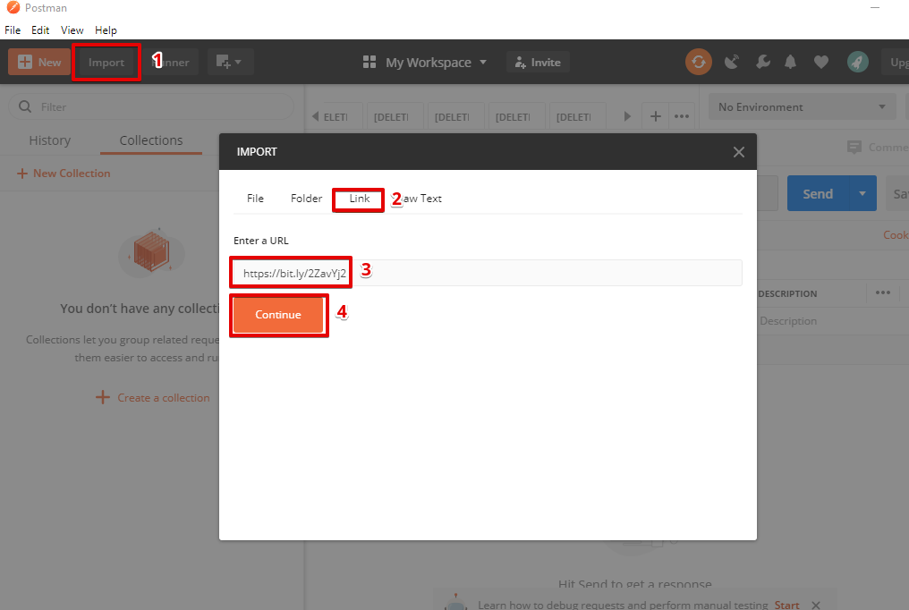
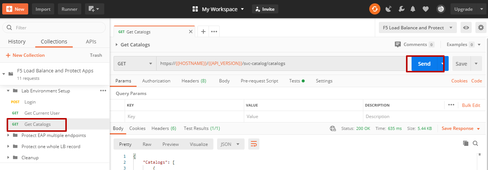
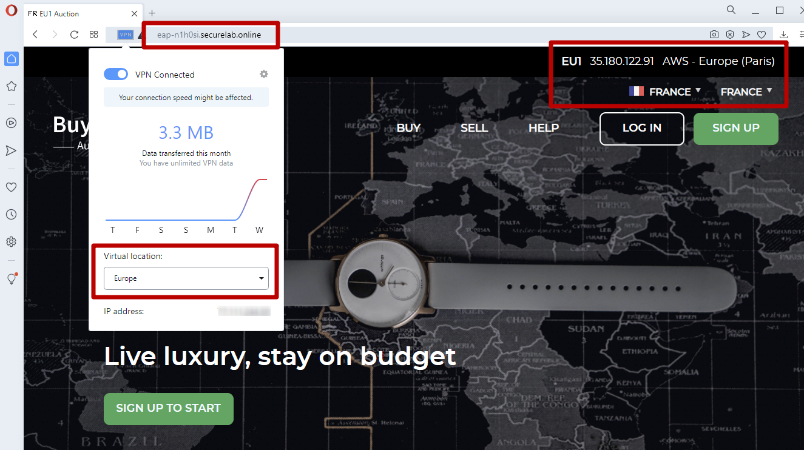
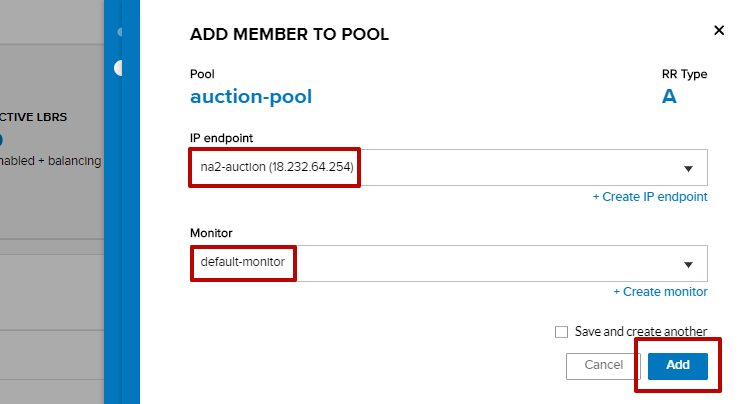

LAB: Load Balance and Protect Applications with F5 DNS Load Balancer and Essential App Protect
==================================================

.. contents:: Table of Contents

Pre-Requisites
###############

- Any modern browser: for working with the UI (and this lab)
- Postman: for working with the API of the F5 Cloud Services
- Opera browser: for simulating geo-location specific traffic

Lab Environment Overview
###############################

1. APIs and Services
*********************

The setup & configuration of the services will be done by sending API requests to the following services:

* **F5 Cloud Services API**: create, use, and remove the services in the scope of this lab

* **Lab service API**: facilitates auxiliary functions for the lab only: creating DNS entries, sending targeted requests & traffic to the apps/services, etc.

Lab Environment Setup
###############################

1. F5 Cloud Services Portal
***************************

`a)` Login

In order to use F5 Essential App Protect and DNS Load Balancer cloud services, you need access to F5 Cloud Services and be logged in with a valid user account. If you need to sign up, or if you already have one, proceed to the `F5 Cloud Services portal <http://bit.ly/f5csreg>`_.

.. figure:: _figures/0_1.png

Once you've logged in with an account, you will be using the user name and password values in the lab to authenticate with the F5 Cloud Services and the API.

`b)` Subscribe to Catalogs

In order to access specific F5 Cloud Services, you need to subscribe to the corresponding service catalogs. The focus of this lab is on F5 Essential App Protect and DNS Load Balancer services, so you will need to subscribe to them. At the time of the writing of this lab you can take advantage of a 15-day free trial offer to work with F5 Essential App Protect service -- no payment method required!

   `1.` Click on the **Your F5 Cloud** tab in the left navigation panel and you will see the available service catalogs, as well as services you have subscribed to, if any. For this lab you will need to subscribe to **DNS Load Balancer** and **Essential App Protect** services.

   .. figure:: _figures/0_2.png

   `2.` You can subscribe to the service, or start a free trial (if available). For full subscription you will need to provide payment information in the **Accounts** - **Payments** section, by adding a credit card, or alternatively subscribing through AWS Marketplace.

   .. figure:: _figures/0_3.png

   After successfully subscribing, your services will appear in the **Your F5 Cloud** tab. You will also see their current status.

   .. figure:: _figures/0_4.png
   
   If you need to check your payment information, it is available in the **Accounts** tab, **Payment** section.
   
   .. figure:: _figures/0_22.png

2. Postman Configuration
**************************

`a)` Download Postman `here <http://bit.ly/309wSLl>`_, open it, create a Postman account if you don’t have one and choose to do so, and sign in.

`b)` Import collection and environment JSON files from the `Git repo for this lab <https://bit.ly/3eb8yhN>`_ :

First, select the Collection JSON file. (NOTE: import of one file at a time seems to avoid some reported issues with Postman). Collection: https://bit.ly/2ZavYj2

Repeat the steps above for the environment JSON file. Environment: https://bit.ly/3ffTcd2

You will now see the imported collection (left side) with calls in several categories, as well as environment variables (top right) used to store and pass data between Postman and the API.

.. figure:: _figures/0_7.png

You are now ready to interface with the F5 Cloud Services using Postman.

3. Opera Browser with VPN to Test Geolocation
**************************

In order to test geo-proximity rules, you can use your own VPN service (if you have one), remote desktop to a VM in a different region (if you have one), or alternatively use the Opera browser. 

Open the Opera browser, click **Settings, Advanced, Features** and then **Enable VPN**.

.. figure:: _figures/0_25.png

F5 Essential App Protect with Multiple Endpoints
#####################

The following diagram captures the deployment topology of this section:

 .. figure:: _figures/chart_1_0.png

1. Get a Custom FQDN (Fully Qualified Domain Name)
************************************************************************

To protect multiple endpoints (North America and Europe), we will first need to create the Essential App Protect instance in the F5 Cloud Services portal. This lab contains a unique Lab Service API that generates a custom FQDN for each user of the lab. Use Postman and follow the steps below to get a personalized FQDN:

`a)` Open the “F5 Load Balance and Protect Apps” environment variables by clicking the “Environment Quick Look”, click into the field of the corresponding variable, and type the value of user email in the variable “USER_EMAIL” (click **Enter** after typing the values). Do the same for the “USER_PASSWORD”.

`b)` Select the **Login** request in the sidebar to login to your F5 Cloud Services profile and click **Send** to get the authorization token. More detailed information on this API request can be found `here <https://bit.ly/2ZauPbi>`_.

.. figure:: _figures/1_1.png

A successful login will result in Postman returning the tokens from the API, shown in the response body below:

.. figure:: _figures/0_9.png

These tokens are then stored for subsequent calls using a function inside Postman to set environment variables. You can see the test function in the “Tests” tab:

.. figure:: _figures/0_10.png

**IMPORTANT NOTE**: If any of the subsequent Postman calls return a blank response or **"status": "unauthorized"** response (see the screenshot below), it means that your user token has expired and you simply need to re-login. To do that you just need to re-send the **Login** request using Postman to capture a new token.

At this point you should be a full user with an "Owned Account" and a primary organization account id, which can also be confirmed in the F5 Cloud Services Portal in the drop-down under your user name (top right), where you should see "Accounts you own:" and the Organization Account you created with **"Owner"** defined.

`c)` Retrieve User ID & Account ID

Select the **Get Current User** request and click **Send** to retrieve User ID and Account ID to be used in the further requests.

.. figure:: _figures/0_14.png

The response returns the following detail:

.. figure:: _figures/0_15.png

The retrieved User ID and Account ID are then stored for subsequent calls.

More detailed information on this API request can be found `here <https://bit.ly/38DsMj5>`_. 

`d)` Retrieve information on available catalogs and their IDs

Select the **Get Catalogs** request and click **Send** to retrieve the data about the available Catalogs and their IDs.

You can see the available catalogs:

.. figure:: _figures/0_18.png

The retrieved IDs are then stored for subsequent calls using a function inside Postman that sets environment variables. You can see the test function in the "Tests" tab of the request:

.. figure:: _figures/0_19.png

More detailed information on this API call can be found `here <https://bit.ly/3iJhTR5>`_. 

`e)` Now let's retrieve your custom FQDN with the **Get FQDN Record type (lab)** API call. Click **Send**. This call will pass your “ACCESS_TOKEN” in the header of the request to the Labs API in order to get a record that will be used to create F5 Essential App Protect instance in the F5 Cloud Services portal. The request is as follows:

The response will return your record name, its status, current type and value.

.. figure:: _figures/1_2.png

Note that at this stage our test application is using an A-record to route traffic that's going to the FQDN to the IP of the app server. During the lab we will update this DNS record to a CNAME generated during the Essential App Protect instance setup, so that the app traffic will be directed to Essential App Protect instance first, and then the "scrubbed" traffic will be directed to our app IP (or FQDN) depending on the configuration.

**IMPORTANT NOTE**: It may take up to 2-3 minutes to generate the custom DNS record personalized for you & your lab. This is a good time to take a quick break, grab some coffee, stretch, and return in a few minutes before continuing. 

When this request completes successfully the value of the FQDN Record will be captured as a variable:

.. figure:: _figures/0_26.png

**NOTE**: Make note of this FQDN record; we will use it many times throughout the lab, and for creating the Essential App Protect service in the F5 Cloud Services portal, as well as throughout the lab as the domain name for your test application.

2. Create Essential App Protect Instance
************************************************************************

Now that you have a customer FQDN record value, you use it as your own "test application" to protect. Let's set up Essential App Protect now:

`a)` Go to the F5 Cloud Services portal, open the **Essential App Protect** tab and click **Start protecting your app**.

`b)` Paste the FQDN record name you copied in the previous section into **"Fully Qualified Domain Name (FQDN)"** field. The **"Name this application"** field will auto-populate; keep this value as-is for simplicity. The **"Add a description"** field is optional. Click **Save & Continue**.

.. figure:: _figures/1_3_1.png

`c)` Essential App Protect does an FQDN lookup to retrieve the corresponding IP of the FQDN record, and will gather info on the location and geo-proximity of the nearest cloud region, and will display these as recommendations for where to deploy the EAP instance. 

**IMPORTANT NOTE**: For the purposes of the lab, please change the Region to the one closest to you! Click **Change** (step 1 in the screenshot below), then select from the dropdown (step 2) the **Region** that is closest to your geographic location. 

Typically in a production environment you would select the recommended region (the one closest to the app). However, because in the lab we're using an existing deployed app, we would like to avoid putting multiple EAP instances all in one region. So, for the purposes of the lab, please manually change the region to the closest to your location. 

**Note:** If after a minute you don't see the endpoint info, refresh your browser and click "Complete Setup" to return to this step / see the info.

Click **Save & Continue**.

Note the info on the IP, City, State, and the Cloud Provider used by our test application. It also shows the region used by the cloud provider derived from the FQDN/IP information. As you can see in the screenshot, the example test app endpoint is located in North America, US East (N. Virginia) and is deployed on Amazon AWS. Note that the default configuration will be to route the traffic that's hitting the EAP instance to the identified IP address of the application endpoint.

.. figure:: _figures/1_4.png

`d)` You can now provide an SSL/TLS certificate if you want to. However, for the lab at this point we will skip uploading the certificate and for now will only select "Enable HTTP Listener" with Port 80, and uncheck "Enable HTTPS Listener", then click **Save & Continue**.

.. figure:: _figures/1_5.png

`e)` Accept the defaults for all of the app protect features on the next screen and click **Save & Continue**. In case you need to update this property in the future, you can do so later in the **PROTECT APPLICATION** section.

.. figure:: _figures/1_6.png

`f)` Here take note of the **CNAME** value that's generated for your Essential App Protect instance. This value will be used to update our application's DNS record by changing it from an IP address to a CNAME. You should probably copy + paste it to a temporary document, but we'll also retrieve it through the UI and an API call later. Click **Done** and Essential App Protect service will be created and should be ready for use shortly.

**IMPORTANT**: Note that this process may take some time. You can check the status in the **All my applications** option of the dropdown menu:

.. figure:: _figures/0_27.png

3. Add an Additional Endpoint
************************************************************************

In the previous step we configured protection for just one application endpoint located in North America, US East (N. Virginia) and deployed on Amazon AWS. But our application is serving a global audience, so let's add the second endpoint located in Europe for European users.

`a)` Go to the F5 Cloud Services Portal, the **Essential App Protect** service and move on to the **PROTECT APPLICATION** card. There, in the **General** tab, select **Manage regions**.

.. figure:: _figures/1_8.png

`b)` Hit **Add** to add another region: 

.. figure:: _figures/1_9.png

`c)` Configure the Europe region. First, select the region from the drop-down menu and then select **IP Address** as endpoint type. Fill in the **IP Address** field with **35.180.122.91** and **Enable HTTP** port, **80**. **Save** the settings.     

As a result, now you should see both endpoints for your application:

.. figure:: _figures/1_12.png

IP Endpoints will also be updated in the **General** tab of the **PROTECT APPLICATION** card. 

.. figure:: _figures/1_13.png

`d)` Now let's see our app's endpoints on the map. Go to the **MONITOR APPLICATION** card where you can see that both endpoints are shown on the map - one in North America, the other one in Europe.

4. Update DNS Settings Using CNAME
************************************************************************

Now that your Essential App Protect instance is created with two endpoints, we will update the DNS settings of our test app by switching the A-record (that previously pointed to the IP address of the app server) to the newly-created CNAME provided by the EAP setup. This way we will start routing all of the traffic that resolves the app's DNS record to Essential App Protect. Let's do that in the following steps!

`a)` Let's go to Postman and use the **Get EAP Subscription** request to get the "subscription_id" and "CNAME" using your "ACCESS_TOKEN".

The response will return all information on your instance which we have created via UI. More detailed information on this API request can be found `here <https://bit.ly/31XJTuz>`_. 

`b)` Now send the **Update CNAME Record (lab)** request to update our test app's DNS Settings with the generated CNAME, which we captured in the UI earlier, and just now in the previous step using the API request as well:

.. figure:: _figures/1_14_2.png

The response will show the updated type ("CNAME") and value.

**IMPORTANT NOTE**: It may take up to 2-3 minutes to update your custom DNS record / CNAME Value. This is a good time to take another quick break, grab some more coffee, have a quick snack, and return in a few minutes before continuing. 

`c)` Test CNAME change via the F5 Cloud Services portal 

Return to the F5 Cloud Services portal, open the **Essential App Protect** tab, select your app from the dropdown menu and click **PROTECT APPLICATION**. Then open the **DNS Settings** tab and click **Test updated DNS**.

You should see "Success" indicating that our DNS updates succeeded!

5. Test Geolocation with Opera Browser
************************************************************************

Now let’s test the protected app, as well as the multi-region support using the Opera browser. As you remember, we now have two endpoints for users in North America and Europe, so we'll test those two locations. Keep in mind that Essential App Protect uses performance-based routing to determine the closest endpoint to drive the users to. This means for true geo-proximity based routing it's best to use a service like the `F5 DNS Load Balancing <https://github.com/f5devcentral/f5-cloudservicednslab>`_.

`a)` Open the Opera browser, click **VPN** and first select **Americas**. This will simulate your entering the test app (BuyTime Auction) from the America region. Then copy FQDN name in Load balanced record properties and paste into the browser. You will get to that IP endpoint which is located in North America, US East (N. Virginia).

`b)` And now select **Europe** in **VPN** of the Opera browser and **Reload** the page. You will get to the European IP endpoint, which means that European users are directed to that IP Endpoint.

6. Execute an Illegal Filetype Attack
************************************************************************

At this point our app is configured for monitoring mode, and so it does not yet block any malicious traffic. 

Nevertheless, let's simulate an attack: illegal file type in **Monitoring** mode. This attack combines a valid URL path segment with various additional input to try to guess or brute-force download of sensitive files or data. More detailed information can be found `here <https://bit.ly/3eaVB7C>`_. And then we can change **Monitoring** to **Blocking** and see the difference.

`a)` In the F5 Cloud Services portal go to **VIEW EVENTS** card which shows different event types for your app. For now, there are no events shown.    

.. figure:: _figures/1_17.png

`b)` Open any browser, paste **FQDN** of your app and add at the end: **/nginx.config**

.. figure:: _figures/1_18.png

Considering that attacks aren't blocked and only monitored for now, the server will respond with a file **nginx.config** that happens to exist on the server. This simulates an attacker brute-forcing a .config file download, and this scenario is precisely what we'll try to catch next. 

`c)` Let's got back to the F5 Cloud Services portal and see the **VIEW EVENTS** card. It will show all the information about the attack and indicate its status as **Not blocked**.

.. figure:: _figures/1_19.png

`d)` Now let's change the mode of **High-risk Attack Mitigation** from **Monitoring** to **Blocking** in order to block all the coming attacks of that type. To do so, go to the **High-risk Attack Mitigation** tab and toggle **Blocking Mode** on. You can notice that **config** file type is checked as disallowed. Click **Update** (and give it a few seconds to update).

.. figure:: _figures/1_20.png

`e)` Now we can simulate the same attack again in the browser by pasting **FQDN** of your app and adding **/nginx.config**, and see quite a different result: the attack is not just monitored, but also blocked this time!  

.. figure:: _figures/1_21.png

Go back to the F5 Cloud Services portal to the **VIEW EVENTS** card and see the status of the new attack: 

.. figure:: _figures/1_22.png

7. Enable All Protection and Simulate Additional Attacks
************************************************************************

For now only **High-risk Attack Mitigation** attack types are configured to be in **Blocking Mode**. Other malicious traffic or attacks to your app are only monitored without any actions taken. Let's now activate **Blocking Mode** for the other protection. 

`a)` First, go to the **Threat Campaigns** tab and toggle **Blocking Mode** on. Then click **Update** (and give it a few seconds to update).

.. figure:: _figures/1_23.png

`b)` Now move on to the **Malicious IP** tab and toggle **Blocking Mode** on. Then click **Update** (and give it a few seconds to update).

.. figure:: _figures/1_25.png

`c)` Now that the protection mode is "blocking" for all attack types, you can simulate more attacks and see them blocked. So, let's return to Postman and use our Lab service API to simulate a flood of attacks by sending the **Start EAP Attack (lab)** request.

`d)` Check the map

Let’s go back to the F5 Cloud Services portal and check the map in the **MONITOR APPLICATION** tab.

You can see our two app endpoints (blue circles) and the latest attacks indicated on the map:

.. figure:: _figures/1_27.png

`e)` View Events 

You can analyze the details of these attacks via the F5 Cloud Services portal in the **VIEW EVENTS** tab of the EAP service. URI, Severity, Category, Violations, Type, Status, IP Address and Source location are shown there.   

Add Protection to a Load-Balanced Record
########################################

F5 Essential App Protect can work together with the F5 DNS Load Balancer in order to protect a load-balanced record. As opposed to the previous scenario, where Essential App Protect used multiple app end-points in different regions for **performance based load-balancing**, the DNS Load Balancer can be used to create advanced geo-proximity load balancing with load-balanced pools and granular controls over regions, countries, and states. 

In this section we will use the F5 Cloud Services UI to set up the Load Balancer DNS record, add endpoints for our Auction app, add health checks, load balanced pools, and run through a few configuration options. This will create a configuration where the DNS Load Balancer will monitor endpoint health, and direct traffic to healthy endpoints in the appropriate geographically-distinct load-balancer pool created for this region. 

The following diagram captures the core components of this section:

.. figure:: _figures/chart_3_0.png

1. Get Zone
************************************************************************

To create a DNS Load Balancer instance, we'll need to get the zone. To do that, send the **Get DNS Zone (lab)** API call. This call will pass your “ACCESS_TOKEN” in the header of the request to the Labs API in order to validate existence of your F5 account & return back a Zone name unique to your lab.

**Note** that you need to copy the **zone** name generated in the API response to be used in the next step to create a DNS Load Balancer instance.

2. Create F5 DNS Load Balancer Cloud Service
************************************************************************

Let’s now create the DNS Load Balancer Service to provide global availability and performance with health-check and built-in DDoS protection.

`a)` Go to the F5 Cloud Services portal and open the **DNS Load Balancer** tab. Click **Create**.

.. figure:: _figures/3_3.png

`b)` Paste the name of the zone we copied in step 1. above and click **Create**.

.. figure:: _figures/3_4.png

Your DNS Load Balancer instance will appear on the list but in Inactive status. You can change the status after creating a load balanced record and pool.

.. figure:: _figures/3_5.png

3. Add Load Balanced Record Endpoints with Health Check
************************************************************************

To distribute the load, DNS Load Balancer will need to monitor the health of each IP Endpoint. So, let’s first create a monitor.

`a)` Click on the created DNS Load Balancer instance and go to the **Monitors** tab. Then click **Create**.

.. figure:: _figures/3_6.png

`b)` Fill in monitor name, choose "HTTP Standard" protocol, indicate "80" port and click **Save**.

`c)` Your monitor is created. Now let's add two IP endpoints with health check for balancing the traffic. DNS Load Balancer chooses an IP endpoint based on the request origin and configuration of IP endpoints, as well as IP Endpoint health. So, go to the **IP endpoints** tab and then click **Create**.

.. figure:: _figures/3_8.png

`d)` Fill in name ("na1-auction"), IP address ("34.229.48.248"), port ("80") and select the monitor we created above. **Save** the first IP endpoint. 

The first **na1-auction** IP endpoint will appear on the list. 

`e)` Let's add the second IP endpoint by clicking **Create** once again on the **IP endpoints** tab. Then fill in name ("na2-auction"), IP address ("18.232.64.254"), port ("80") and select the monitor we created above. **Save** the second IP endpoint.  

.. figure:: _figures/3_10.png

Now you can see two IP endpoints you've just created!

4. Configure Load Balanced Record Pool
************************************************************************

Now let's create a pool with two IP endpoint members in it. 

`a)` In the F5 Cloud Services portal go to the **Pools** tab and then click **Create**.

.. figure:: _figures/3_12.png

`b)` Fill in its name ("auction-pool"), choose "A" record type and "round-robin" method. Then click **Next**.

.. figure:: _figures/3_13.png

`c)` Let's add the IP endpoints we created in step 3. above to our pool. Click **Add Member**.

`d)` First select the first endpoint we’ve just created, as well as the monitor, and click **Add**. 

.. figure:: _figures/3_15.png

And then select the second endpoint we’ve just created, as well as the monitor, and click **Add**.  

`e)` After you see both pool members added to the pool, click **Create**. 

.. figure:: _figures/3_18.png

A newly created pool with the two endpoints will appear on the list.

5. Configure the Load Balanced Record
************************************************************************

After creating all of the required DNS Load Balancing elements (IP endpoints, Pool and Monitor), we can create a DNS Load Balancer record with its proximity rule, which will be used to create advanced geo-proximity based routing and will be protected by the F5 Essential App Protect.

`a)` Go to the **Load balanced records** tab and then click **Create**.

.. figure:: _figures/3_19.png

`b)` First, fill in LBR name as "auction", host as "auction", select "A" as "Resource Record Type" and set a proximity rule ("Anywhere" -> "auction-pool" pool) to direct requests from anywhere to the pool with two endpoints that we created earlier. Set score of the proximity rule to be "1". This will define the priority of the rule in case if some more are added.

Click **Add Rule**, then check **Enabled**  and **Save** the record.

.. figure:: _figures/3_20.png

`c)` Go back to the **DNS Load Balancer** tab, click on the menu of your service and select **Activate**.

The DNS Load Balancer service is now setup.

6. Update the Essential App Protect Instance
************************************************************************

For this section we will use the F5 DNS Load Balancer for the Essential App Protect instead of multiple app endpoints in different regions. We will first add the Load Balanced record as the new endpoint to be protected, follow a few steps below. 

`a)` In the F5 Cloud Services portal go to the **Essential App Protect** tab, in the drop-down menu select the app you created in the first section, then proceed to the **PROTECT APPLICATION** card and go to the **General** tab. In the **DEPLOYED REGIONS** section, you can see those two endpoints which we added in the first section. Now let's click **Manage regions** and change the settings.  

.. figure:: _figures/3_40.png

`b)` Click **Add** to set up a new region. 

.. figure:: _figures/3_41.png

`c)` Select **AWS: US East (Ohio) us-east-2** as a new region and **DNS Name** as the endpoint type. Then **Enable HTTP** with port **80** and click **Save**. 

.. figure:: _figures/3_42.png

The new region will appear on the list of your available regions. 

`d)` Now let's delete the two regions which we added in the first section. Check both of them and click **Delete**.

.. figure:: _figures/3_43.png

Only the newly created region will remain on the list.

`e)` Click **Close** to save the new settings.

Finally, you'll get back to the **General** settings of your Essential App Protect instance and see the updated **DEPLOYED REGIONS** section.

.. figure:: _figures/3_45.png

Now, the Essential App Protect service will now protect the Load Balanced record and in turn the DNS Load Balancer will monitor endpoint health, and direct traffic to healthy endpoints in the appropriate geographically distinct load-balance pool created for this purpose.

7. Simulate SQL Injection Attack
************************************************************************

SQL Injection attack inserts a SQL query via the input data field in the web application. Such attacks could potentially read sensitive data, modify and destroy it. More detailed information can be found `here <https://bit.ly/2ZUv0Xl>`_.  

Let's now simulate SQL Injection attack via browser and our "BuyTime Auction" app. Copy your FQDN from the F5 Cloud Services portal and paste to your browser. In the **LOG IN** window fill in username value as follows (including singls quotes) **' OR 1=1 --'** and use any password as the value. Click **LOGIN**. 

In the Essential App Protect events you we can see that our SQL Injection attack is blocked.

Clean Up
#####################

At this point feel free to explore and repeat any of the previous steps of the lab, but should you want to clean up the resources you've created and remove your services, then follow the steps below.

1. Clean Up the Instances
**********************************

`a)`  First of all, we'll need to change Essential App Protect record type back (if you remember, in the very beginning we updated it from type A to CNAME). Go to Postman and send the **Reset EAP Record (lab)** request to change record type from CNAME to A back:

.. figure:: _figures/4_1.png

`b)` After that, send the **Retire DNS Zone (lab)** request to remove or reset zone file. 

`c)` Now let's return to F5 Cloud Services portal and delete Essential App Protect instance. Open the **Essential App Protect** tab, and select **Delete** in your app's menu. 

.. figure:: _figures/4_3.png

Your instance will be deleted.

`d)` Now let's delete DNS Load Balancer instance. Open the **DNS Load Balancer** tab, and select **Delete** in your service's menu.

.. figure:: _figures/4_4.png

2. Clear Tokens from the Lab Service API
*********************************

We recommend that you clear your tokens from the Lab Service API for security purposes. In order to do that, send the **Logout** request, which uses your **ACCESS_TOKEN**:

.. figure:: _figures/4_5.png

More detailed information on these API requests can be found `here <https://bit.ly/3fsxceU>`_.

We hope you've enjoyed this lab! Sign up for any of the F5 Cloud Services for the full experience!
